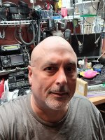
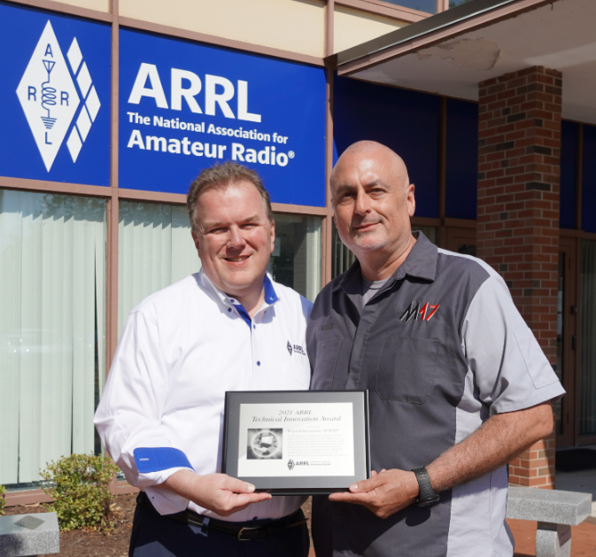
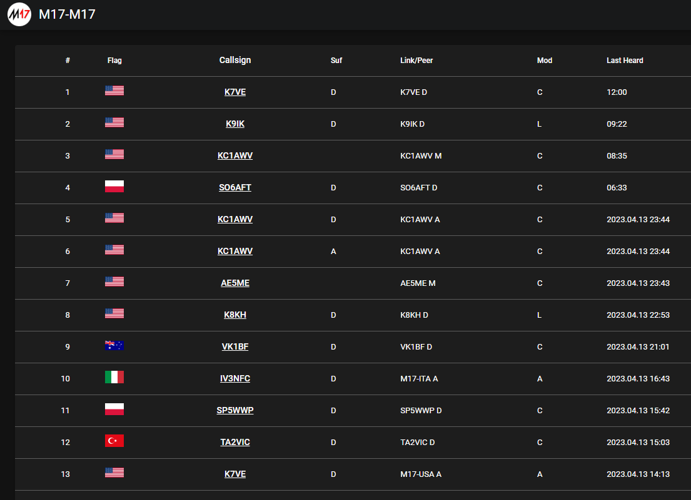
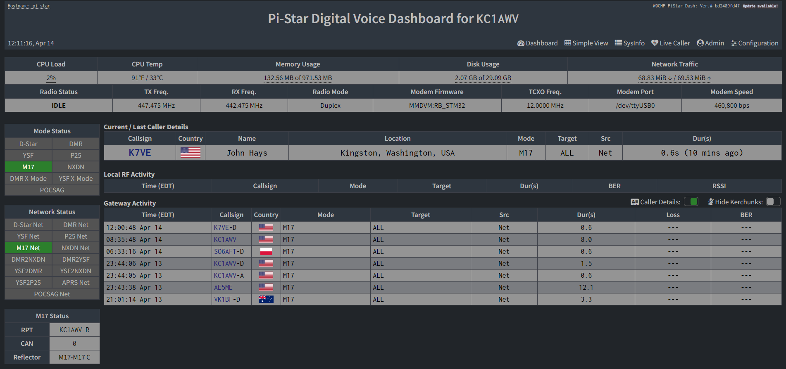
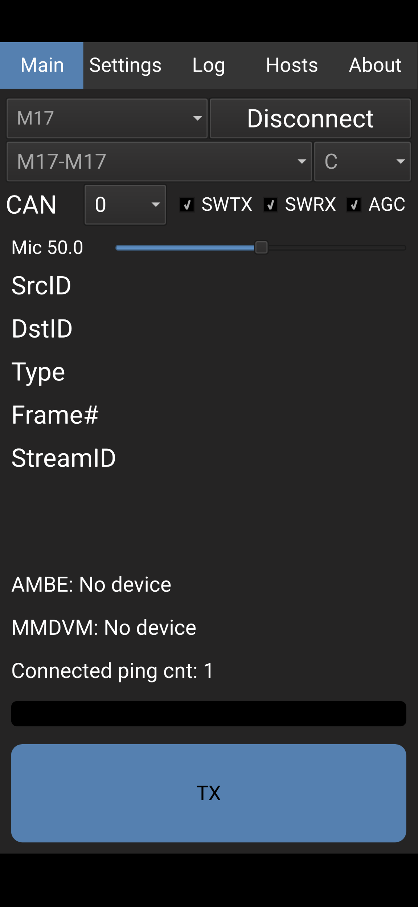
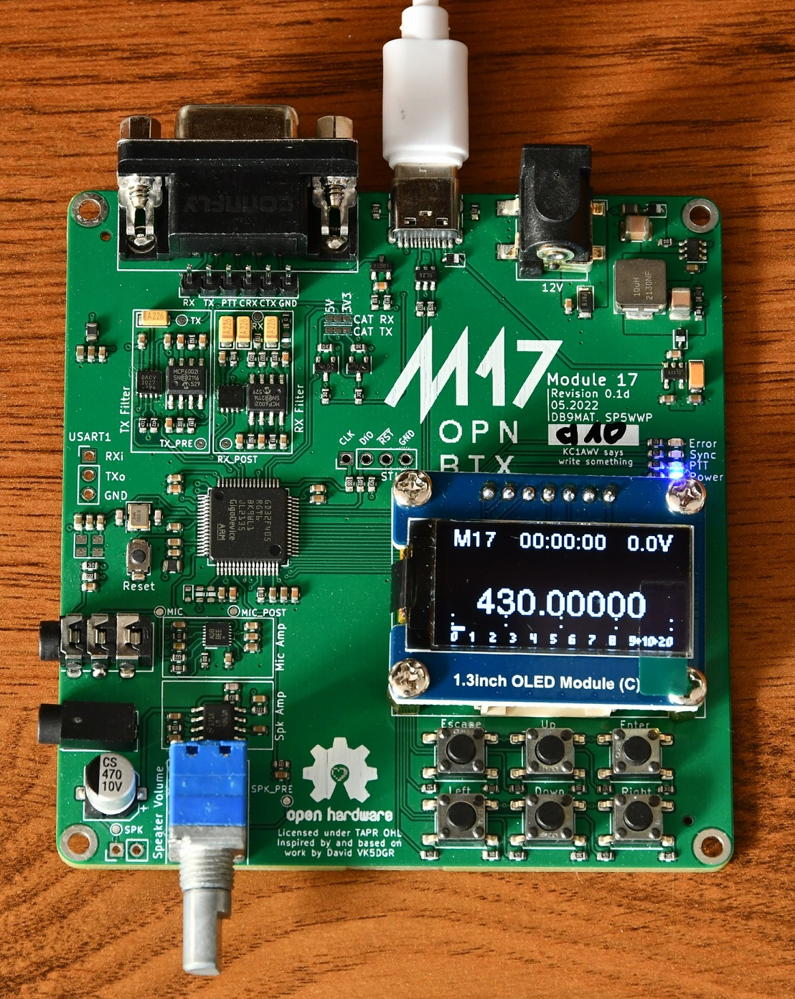
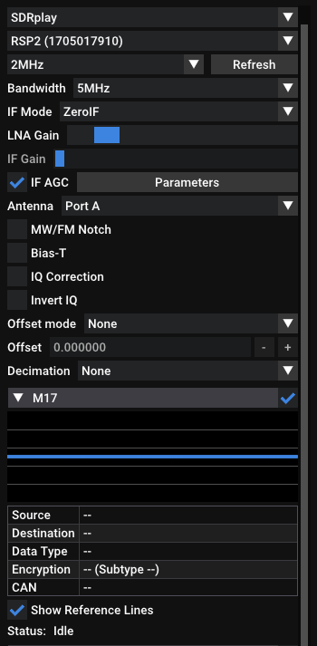

<style>
  :root {
    --color-background: #333;
    --color-foreground: #fff;
    --color-highlight: #f96;
    --color-dimmed: #888;
  }
</style>

<!-- _class: lead -->


# M17 Project
Open Source Amateur Radio

---

<!-- Edit this slide with your own info and photos -->



# Speakers

## Steve Miller KC1AWV
Systems administration and Integrations

## Ed Wilson N2XDD
Community Manager and Pimary NCS

---

# What is M17?

<!-- Don't read this slide verbatim. Important points are that M17 first started as just a new radio protocol, but has now grown into a large community of developers, hackers, and enthusiasts. It is also important to note that while the protocols listed are "open" they rely on proprietary hardware or infrastructure as originally designed. Can't buy a D-Star radio that's not made by Icom (yes, Kenwood too...) or a Fusion radio not made by Yaesu. AMBE2+ vocoder is still closed source as of this writing. -->

From the M17 Project website: https://m17project.org

> M17 is a community of open source developers and radio enthusiasts. We're building understandable systems in support of the hackers and experimenters' history of ham radio.

Existing VHF/UHF DV modes are mostly derived from commerical or public service standards (DMR, P25), are proprietary (Fusion) or are mostly open with proprietary components (D-Star). The vocoder in all of these modes is a proprietary AMBE/IMBE variant from DVSI.

---

# M17 Application Features

<!-- Important to state here that M17 is a VHF+ digital voice and data protocol. Some people may initially assume this is a digital mode for HF like FT8. M17 could be used on HF, but not legally at least in the US (ITU-2). The symbol rate is too high, and the occupied bandwidth is too wide. A lot of DMR folks may be interested in the no callsign database requirement. M17 does not require registration of any kind, unlike DMR and D-Star. -->

Fully open source hardware and software, including the Codec 2 vocoder. Specification is available at https://spec.m17project.org

Built by a global team of amateurs

9600 bps 4FSK modulation (4800 symbols/sec) in 9kHz bandwidth

Codec 2 at 3200 bps (voice only), or Codec 2 at 1600 bps (mixed voice and data)

No callsign database needed

---

# M17 Application Features

<!-- SMS is common in DMR and D-Star, maybe P25. Packet mode doesn't seem to be popular on other modes, but is fully supported and easy to implement in M17 (KISS TNCs). Stress the optional when talking about encryption, not everyone is happy when they hear the word encryption. Also be sure to point out that M17 is manufacturer agnostic, anyone can make an M17 radio that would be interoperable with another as long as the specification is followed.  -->

Short message support (SMS)

File Transfer support (Packet Mode)

GPS location reporting and APRS integration

_Optional_ strong encryption

Simplified reflector operation and callsign routing

Manufacturer agnostic - can be implemented by any capable platform

---

# History

<!-- This is a brief history, and may exclude some other facts of lesser importance. This also takes care of the question "why is it called M17?" -->

M17 started in Warsaw, Poland, by Wojciech Kaczmarski SP5WWP while he was a member of the SP5KAB radio club

After experimenting with existing DV modes, Wojciech deceded to create a different mode, now called M17. The name is derived from the address of the SP5KAB radio club, Mokotowska 17

Now, four years later, a global team has contributed to M17 hardware and software, testing, publicity, and maintenance of infrastructure

---

# ARRL Technical Innovation Award

<!-- Wojciech received the award, Ed accepted it on his behalf at ARRL headquarters. It was then sent to him in Poland. The reward money was donated by Wojciech into the M17 Project. -->

> The 2021 ARRL Technical Innovation Award honors Wojciech Kaczmarski, SP5WWP, for developing a new digital radio communication protocol, M17, for the good of amateur radio. 



```
Pictured: ARRL CEO David Minster NA2AA (left) and M17 Community Manager Ed Wilson N2XDD (right)
Photo credit: Alex Norstrom KC1RMO
```
---

# Development


M17 is under very active development. Many parts of the M17 ecosystem are currently available:

- Reflector
  - mrefd by Tom N7TAE
  - IPv6 capable
  - No callsign database needed

---

# Development


M17 is under very active development. Many parts of the M17 ecosystem are currently available:

- Repeaters and Hotspots
  - MMDVM by Jonathan G4KLX
  - MMDVM_HS by Andy CA6JAU
  - WPSD by Chip W0CHP

---

# Development


M17 is under very active development. Many parts of the M17 ecosystem are currently available:

- Internet clients
  - mvoice by Tom N7TAE
  - M17Client by Jonathan G4KLX
  - DroidStar by Doug AD8DP

---

# Development


M17 is under very active development. Many parts of the M17 ecosystem are currently available:

- Radio modems
  - Module 17 by Mathis DB9MAT
  - Opi17 by Pedro M0IEI
  - TNC4 by Mobilinkd (WX9O)

---

# Development


M17 is under very active development. Many parts of the M17 ecosystem are currently available:

- Radios
  - OpenRTX (TYT MD series / Retevis RT series)
  - OpenHT
  - SA8x8 modules (very experimental)

---

# Development


M17 is under very active development. Many parts of the M17 ecosystem are currently available:

- SDR
  - SDR++ by Alexandre ON5RYZ
  - Openwebrx by Jakob DD5JFK
  - Rpitx by F0OEO
  - GNURadio (gr-m17)

---

# Get Involved

M17 is a community that thrives on volunteer participation

Community Aspects:

- Software and hardware development
- Testing
- Publicity and Communication
- 3D CAD and printing
- Operating

---

# Getting on Air
## Internet

- mvoice
  - Linux client
  - Runs on Raspberry Pi
  - Use your own headset

---

# Getting on Air
## Internet

- DroidStar
  - Android app from Play Store
  - Linux available by compiling source
  - iOS was available
  - Windows via obscure build

---

# Getting on Air
## Internet

Cross-mode tools are available through the work of AD8DP

- USRP2M17
- DMR2M17
- M172YSF
- DVSwitch - Analog Reflector

---

# Getting on Air
## RF

Capability of transceiving M17 over RF _is_ possible, now!

MMDVM hotspots and modems can be upgraded to support M17 using MMDVM(_HS) v1.6.0+

Must use updated MMDVMHost and M17Gateway on PiStar, or use WPSD by Chip W0CHP

---

# Getting on Air
## RF

M17 Modem implementations:

- M17Client by Jonathan G4KLX
  - Linux client (also runs on RPi)
  - Uses existing MMDVM Modems and Hotspots
  - Must compile and configure yourself
    - Documentation needed!

---

# Getting on Air
## RF

M17 Modem implementations:

- TNC4 by Mobilinkd
  - Any KISS capable software
  - M17HT Android App
  - Must use 9600 baud capable radio

---

# Getting on Air
## RF

Partial (RX only)

- SDR++ by Alexandre ON5RYZ
  - Builtin M17 decoder
- Openwebrx by Jakob DD5JFK
  - Optional M17 decoder

---

# Getting on Air
## RF

Partial (TX only)

- rpitx
  - Transmits baseband M17 from a Raspberry Pi via GPIO pin

---

# Getting on Air
## RF

TX/RX

- OpenRTX
  - TX and RX work, with modifications to specific radios
- Module 17
- OpiM17
- M17AnalogGateway

---

# Getting on Air
## RF

TX (soon, RX)

- m17-tools derived from m17-cxx-demod
  - Works with DigiRig
  - Runs on Windows!

---

# Grants, Sponsors, and Partners


Grants from ARDC
- April 2021, granted $250,000 for research and development
- December 2022, granted $228,900 to DARC for M17 development

---

# Grants, Sponsors, and Partners


OCF Fiscal Sponsor
- Provides all benefits of a 501(c)(3) non-profit with fiscal support
- Donations to M17 accepted through OCF

---

# Grants, Sponsors, and Partners

OpenRTX
- Develops firmware with M17 support for many radio platforms

Ettus Research
- Provided hardware for RF research and development

ZUMRadio
- Provided hardware to support M17 development on hotspot and modem platforms

---

# More Information

M17 Project https://m17project.org
OpenRTX https://openrtx.org
Open Collective https://opencollective.com/m17-project

M17 Project Net on Fridays at 1700 UTC
- Reflector M17-M17 Module C

Discord https://discord.gg/G8zGphypf6
Matrix https://matrix.to/#/#m17project:matrix.org